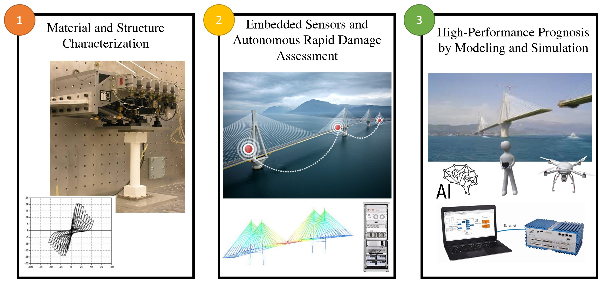
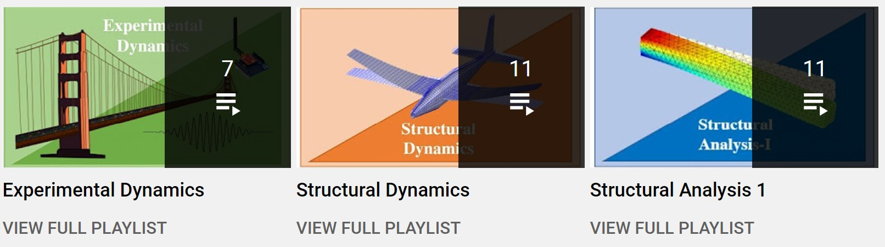

## Research Interests

 Dr. LI, Jin-Yang (李锦阳) is currently a PostDoc working with <a href="https://songyezhu.wixsite.com/mysite">Prof. Songye ZHU</a>.
He obtained both his Bachalor (2014) and Ph.D. degrees (2020) from <a href="https://www.polyu.edu.hk/en/cee/"> CEE </a> @ <a href="https://polyu.edu.hk/"> PolyU</a>.

Research Interests:   
- **Smart Electromagnetic Dampers**
Development of advanced electromagnetic dampers (EMD) capable of simultaneous energy harvesting and actuation features. Authentic self-powered active control.

- **Energy Harvesting**
Development of advanced electromagnetic dampers capable of simultaneous energy harvesting and actuation features

- **Energy Harvesting**
Development of advanced electromagnetic dampers capable of simultaneous energy harvesting and actuation features

● 方向1：智能结构与振动控制

智能结构又称机敏结构(Smart/Intelligent Materials and Structures)，泛指将传感元件、驱动元件以及有关的信号处理和控制电路集成在材料结构中，通过机、热、光、化、电、磁等激励和控制，不仅具有承受载荷的能力,而且具有识别、分析、处理及控制等多种功能,能进行自诊断、自适应、自学习、自修复的材料结构。该方向使用智能结构（包括压电、电磁及形状记忆合金等）发展新型振动控制方法，探究内在机理、新型理论模型、数值模拟方法以及试验验证方法。目前，以在该领域主持和参与国家自然科学基金2项，以及多项航天预研项目。

● 方向2：非线性振动、动力学与控制及能量回收

非线性系统存在特有的跳跃现象，利用有益的跳跃现象可有效提高隔振系统的隔振能力，从而实现非线性振动控制。基于压电-电磁式结构，发展新型的非线性能量俘获装置，探索俘能特性及变化规律。在线性及非线性动力学理论框架体系下，研究高能量回收-振动控制双功能性，为低功耗器件、无线传感器件提供新型的能量解决方案，拓展智能结构的功能性。

● 方向3：Metamaterial及Origami机器人技术

Metamaterial是新世纪新近发展的人工设计结构，可实现常规材料所不具备的独特物理特性，如负泊松比，负磁导率，具有巨大的应用前景。基于非线性动力学理论，发展新型Metamaterial设计理论，实现高性能减振抑制技术。以此为依据，采用智能材料与结构技术，将Metamaterial与Origami技术结合，研究微小尺度机器人设计技术，探索智能机构的传感、定位与振动控制一体化设计方法，形成多物理场及多尺度下-Metamaterial-智能结构-机器人-控制一体化设计与分析理论体系。本方向为将来重点发展方向。

● 方向4：空间结构设计、分析、优化与控制

● 方向5：机械设计及理论

His research focuses on:   
(1) Development of advanced experimental techniques for characterization of innovative and sustainable materials and structures,  
(2) Autonomous rapid damage assessment techniques based on latest structural health monitoring sensing technologies, and  
(3) Artificial intelligence solutions such as machine learning, computer vision, and big data analytics used for off-line high-performance modeling and simulation, and long-term prognosis of slow evolving but accumulating damage.

---

## Journal Publications

* **Li JY**, Zhu S, Shi X, and Shen W, "Electromagnetic Shunt Damper for Bridge Cable Vibration Mitigation: Full-scale Experimental Study", *Journal of Structural Engineering*, 2020. [<a href="https://ascelibrary.org/doi/full/10.1061/%28ASCE%29ST.1943-541X.0002477">10.1061/(ASCE)ST.1943-541X.0002477</a>]

* **Li JY**, Zhu S, and Shen J, "Enhance the damping density of eddy current and electromagnetic dampers", *Smart Structures and Systems*, 2019. [<a href="https://doi.org/10.12989/sss.2019.24.1.015">10.12989/sss.2019.24.1.015 </a>]

* **Li JY** and Zhu S, "Versatile Behaviors of Electromagnetic Shunt Damper with a Negative Impedance Converter", *IEEE / ASME Transactions on Mechatronics*, 2018. [<a href="https://ieeexplore.ieee.org/document/8309311">10.1109/TMECH.2018.2813307 </a>]

* Shi X, Zhu S, **Li JY**, and Spencer BF, "Dynamic behavior of stay cables with passive negative stiffness dampers", *Smart Materials and Structures*, 2016. [<a href="https://iopscience.iop.org/article/10.1088/0964-1726/25/7/075044/meta">10.1088/0964-1726/25/7/075044/meta </a>]

---
## Teaching
### Online content:  
Amirali has developed three online courses on intermediate and advance level structural engineering topics. These online courses are comprised of 10 videos each and convey the most important aspects of each topic.
 

  
### Teaching history:
- Course instructor: CEE360 - Introduction to Structural Engineering (Spring 2018)
- Teaching assistant: CEE472 - Structural Dynamics (Fall 2017 & Fall 2019)
  
